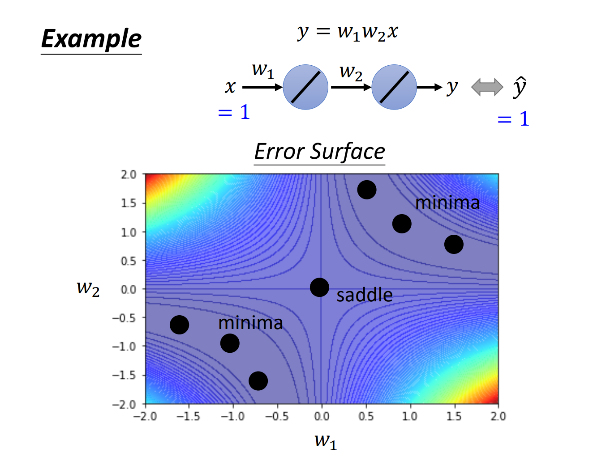
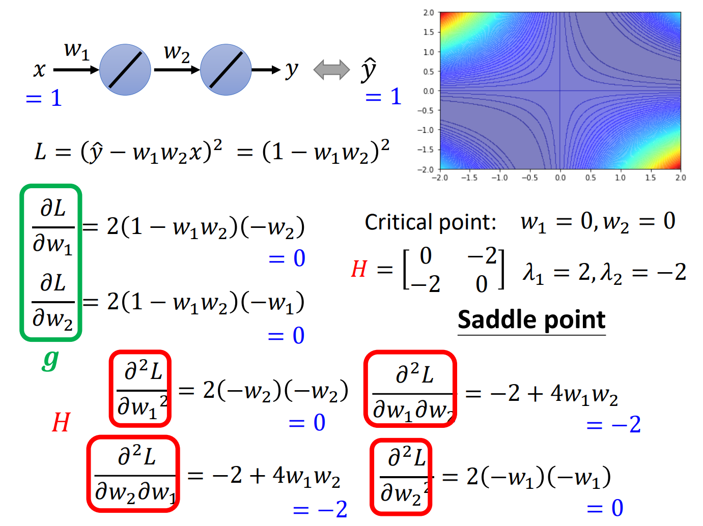
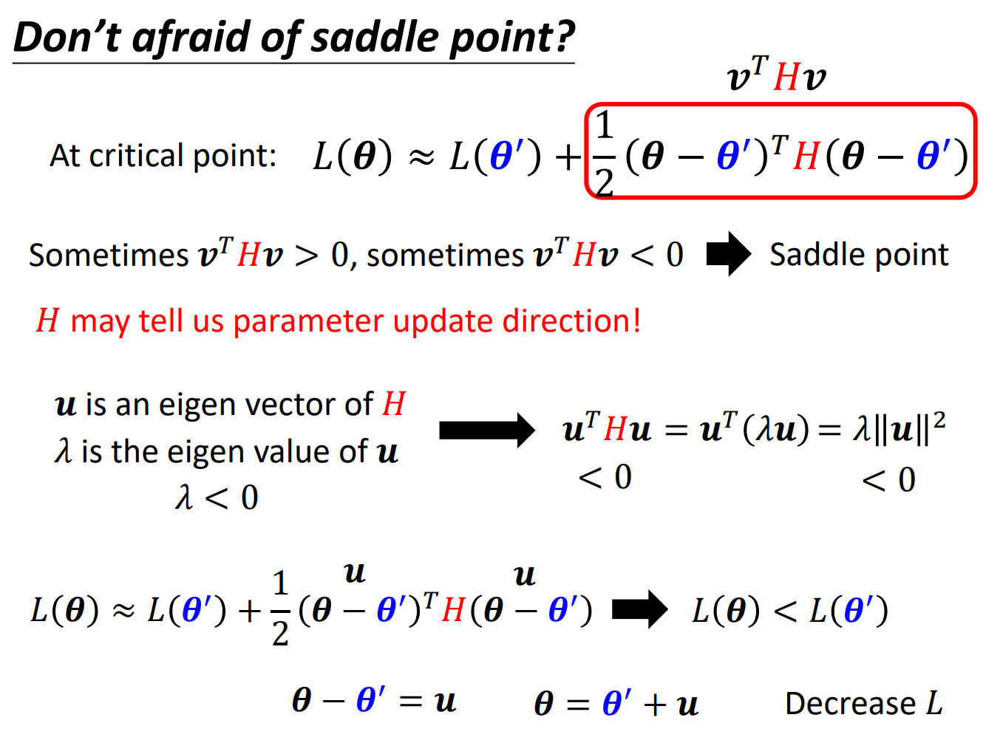
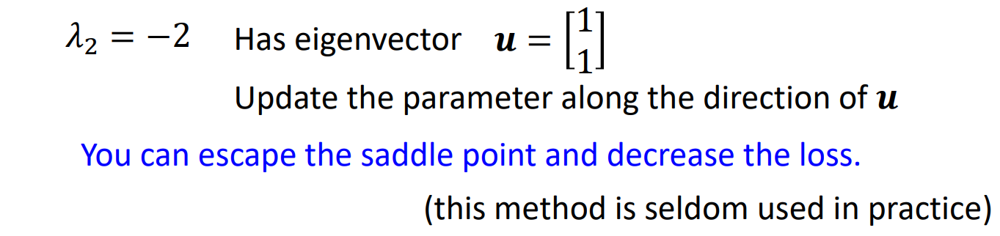
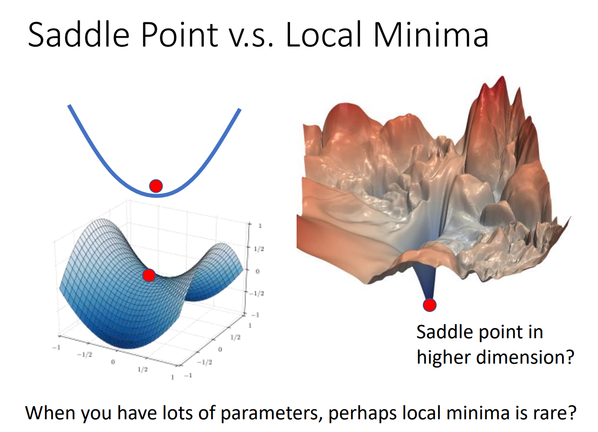
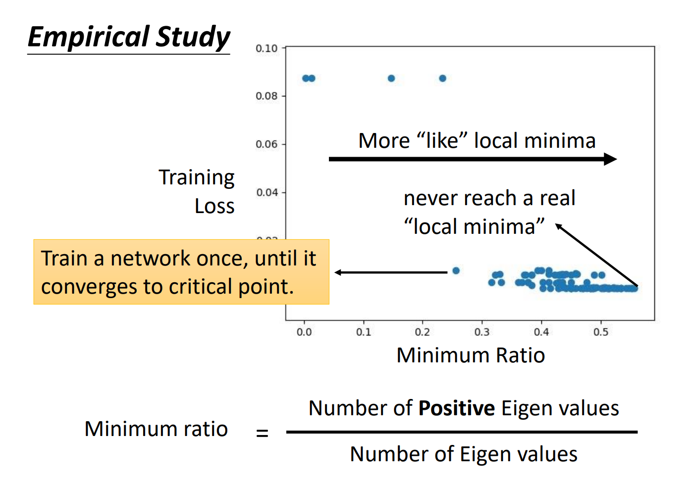

## When gradient is small
### 为什么Optimization会失败？
#### gradient is close to zero
当梯度接近0甚于等于0的时候，参数就会更新很慢或者停止更新，但是这些点并不是一定是**local minima** 也有可能是**saddle point**（如图所示），这些我们都统称为**critical point**。

当我们遇到gradient是0的时候，我们要先判断以下到底是local minima还是saddle point，因为如果是local minima，那确实没有办法更新了，而处在saddle point，我们是由更低的点，我们是有可能改善这种状况的。

### local minima or saddle point？
想要判断critical point的类型需要知道loss function的形状，但是在实际情况中loss function往往非常复杂，我们没有办法得到它的具体形状，但这并不是说我们就无法判断了，我们可以某一组参数附近的loss function，也就是很局部的一小段，可以用泰勒多项式逼近，如下图：

其中g代表了gradient，H则代表了Hessian矩阵，由于我们是处在critical point，所以g=0，我们可以直接忽略第二项，把式子简写。而简写后的式子就给了我们判断critical point的证据：

就像图中所示，这里我们用v来简写了其中的向量，我们可以根据第三项的值分为三种情况，一种情况是第三项大于0，那就证明在θ′附近的L(θ)都要大于它，所以它就是一个极小值点。第二种情况是第三项恒小于0，与第一种情况相反，它应该是一个极大值点。第三种情况就是第三项的值有时是大于0的，有时又是小于0的，那么毫无疑问，这就是我们说的**saddle point**了，如下图所示：

而我们在实际的判断过程中其实不需要把vTHv计算出来，我们只需要判断H的特征值就好了，H如果特征值全为正，即第一种情况，全为负则第二种情况，有正有负则是第三种情况。

我们实际中真的会遇到saddle point的情况吗？这里给出李宏毅老师PPT的例子。

针对上述的例子，我们写出loss function并且枚举w1w2的值之后，我们得到了Error surface，我们会发现，中间的点真的是saddle point，它向左上和右下都是loss增大，右上和左下则是loss减小，而它本身gradient=0！而我们也可以通过写出Hessian矩阵并求出特征值判断出它就是saddle point。

### 那么我们在saddle point的时候怎么确定参数的更新方向呢？
我们可以通过H的一些技巧来确定参数更新方向，我们假设v=u，u则是H的一个特征值的特征向量，我们就会得到如下图的结果，假如我们选取的特征值是一个负的特征值的话，这样我们就得到了一个比θ′点更小的loss值！

或者说我们可以通过向着Hessian矩阵负特征值的特征向量的方向更新，我们就可以逃离saddle point，但是虽然这里把原理讲明白了，但是在实际的过程中，我们的模型不会是这么简单，而参数θ，Hessian矩阵更是如此，我们需要耗费巨大的算力来找出矩阵和它的特征向量，显然是不太可取得，但是我们有别的方法来逃离saddle point。

### saddle point和Local Minima 哪个更常见一点？
其实是**saddle point**！

有人可能会觉得在高维空间的时候是不是其实有路可走呢？在达到足够高的维度的时候，可能local minima其实是非常少见的？实际的经验来了，下图中纵轴是train loss，横轴则是Hessian矩阵中正的特征值占所有特征值的比例，我们可以看到，哪怕我们的loss很小，维度很高，我们也没有达到一个真正的local minima，所以我们在实际应用中碰到的，其实几乎都是saddle point。如下图：

