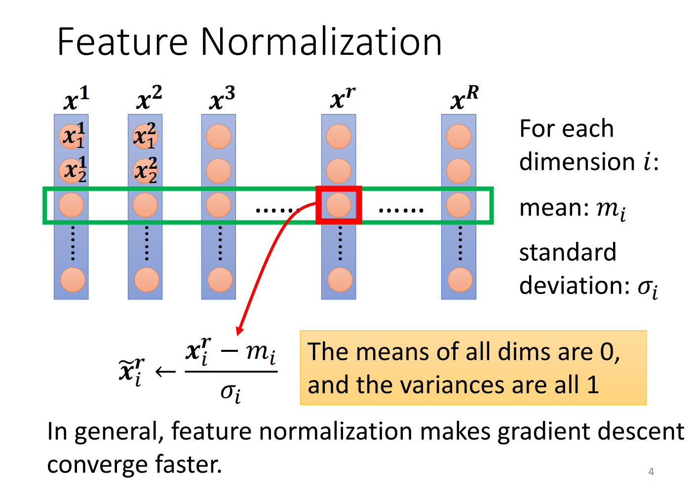
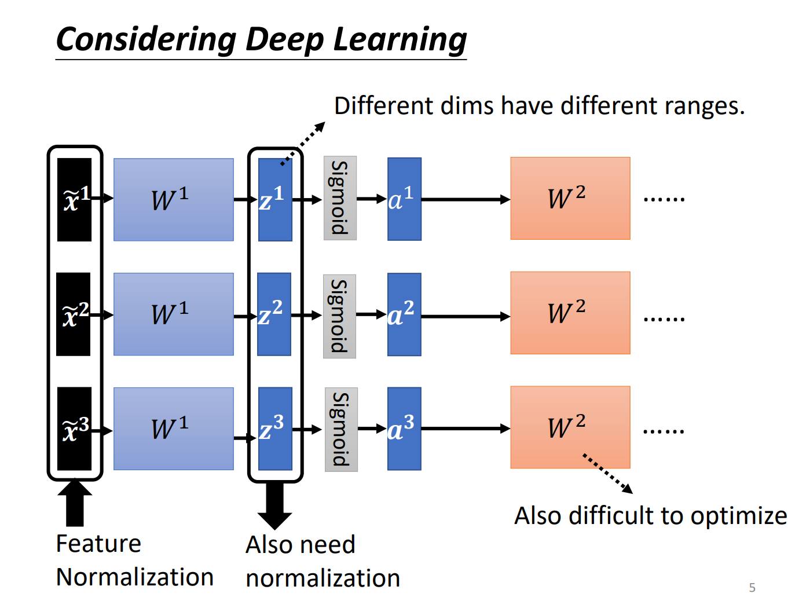
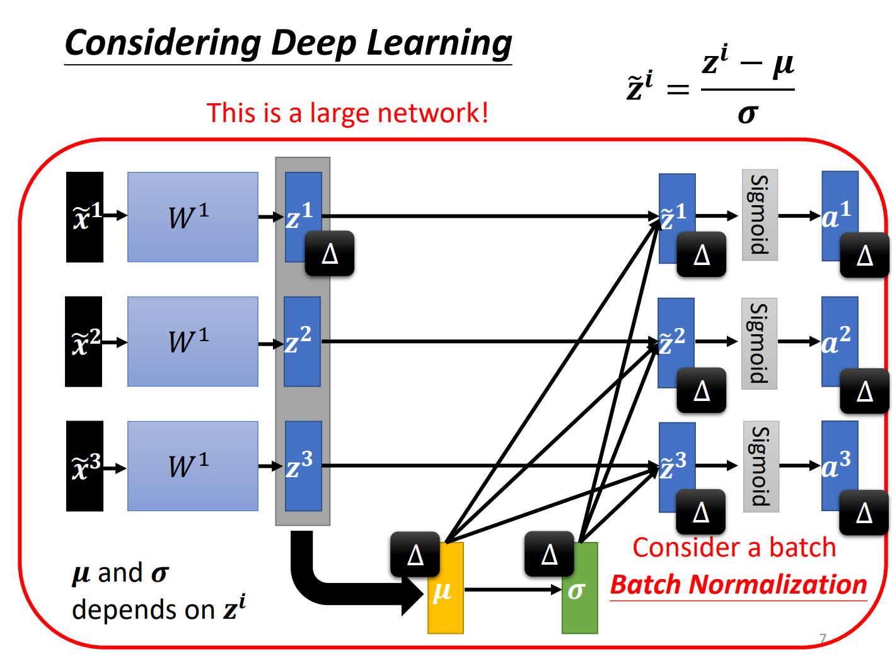

## Batch Normalization
### Changing Landscape
我们之前提到过error surface需要adaptive learning rate的情况，也就是在一个方向上斜率比较大，另一个则比较小，碗形的结果，如图：

我们可以看出来同样加上一个Δw的话，w1和w2对最终Loss的影响还取决于x的Scale，不同的Scale会导致Loss发生变化的程度不同，造成了斜率上的变化，而我们就可以通过Normalization来改善这种情况。

### Feature Normalization

我们可以通过对每一个dimension进行标准化的处理从而得到一个相对更有利我们进行Gradient Descent的数据。

在Deep learning的过程中，我们input Normalization之后的x然后乘以w以后变成了z，但此时z显然不一定保持了原来的Normalization，所以其实在DL过程中，我们需要对z或者a也进行Feature Normalization。（在实际过程中对z或者对a进行Feature Normalization得到的结果基本一致，所以可以自由选择一个即可）

而Batch Normalization正式把样本都考虑为了一个整体，我们根据下图可以发现，其中一个z的改变会导致后续所有a发生变化，因为μ和σ会随之发生变化，也就是说我们会把标准化看作是一个整体，但是在实际的过程中，我们往往因为数据量过大无法直接对所有的样本进行Normalization，所以我们就有了对每一个Batch进行Normalization，这只有在Batch比较大的时候才有效，当Batch比较小或者甚至于为1的时候其实就失去了意义。

