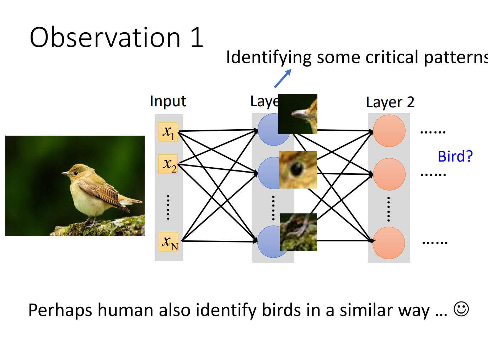
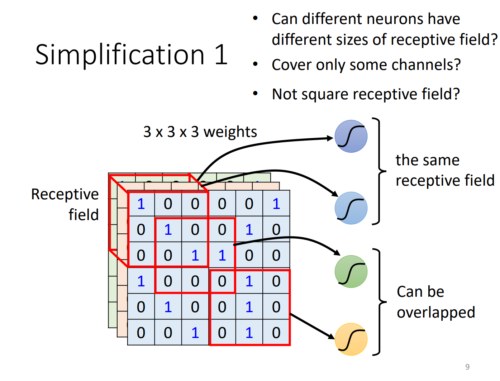
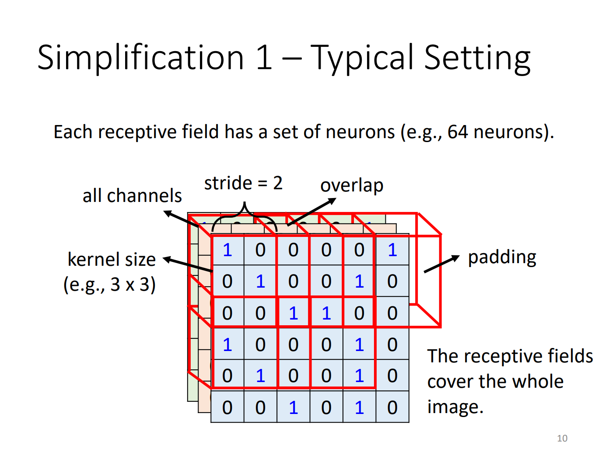
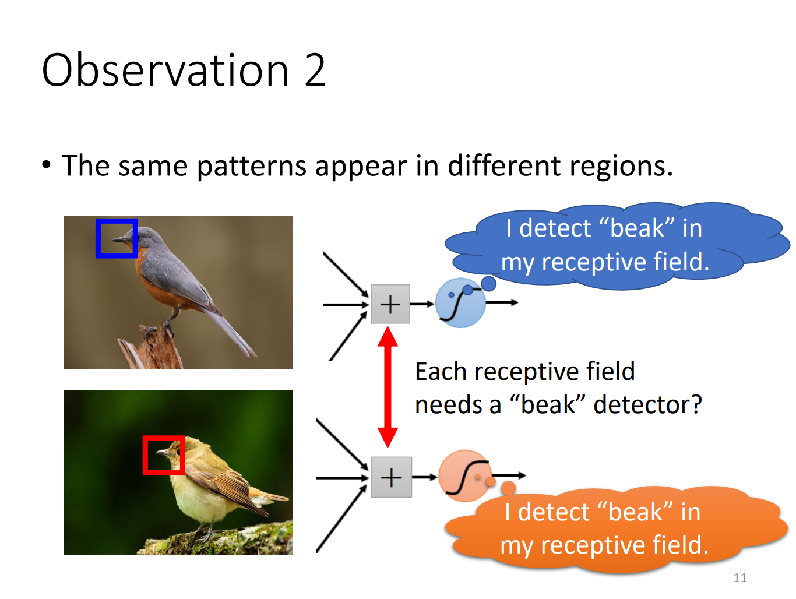
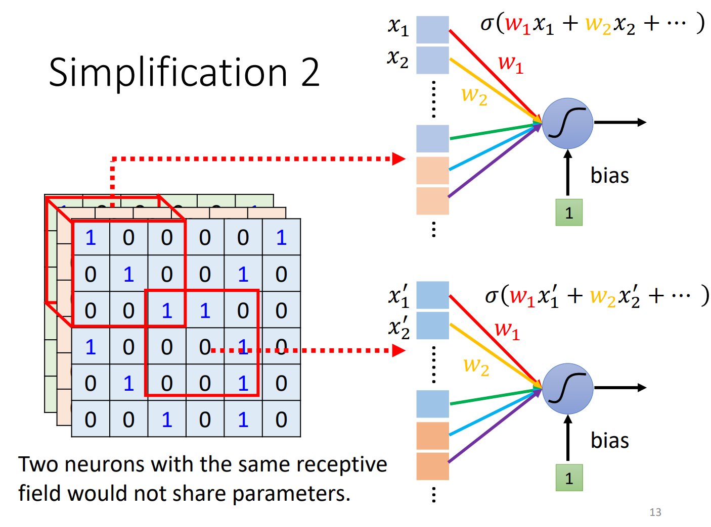
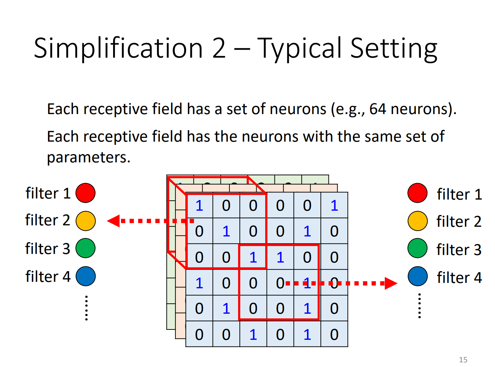

## Lecture3: Images as input
### Convolutional Neural Network（CNN）
#### Image Classification
在这部分我们假设图片大小都是一致的，常见的处理方式是首先将要处理的图片ReScale至同样的大小。大概的流程如下：

**那么图片是怎么作为模型的输入呢？**

其实一张图片是一个三维的Tensor，一个维度代表长另一个维度代表宽，最后一个维度表示channel数目，而channel数目的解释，我们可以把每个pixel看成是由RGB组成，如图所以就变成了一个100* 100* 3，我们需要输入的是一个向量，那么怎么处理呢？可以把它拉直排至一排（列），就变成了如图所示的一个输入：

而矩阵中的每一个数字可以代表图片中对应位置某个颜色的强度。假如我们以100* 100 * 3这样输入，并且假设下一层的neural有1000个，那我们需要的参数w就足足有3*10^7个（如下图），这么多的参数就可能会带来问题：比如参数较多我们的模型弹性较大，然后我们就会比较容易的出现overfitting的问题，所以全连接的神经网络在这里其实并不适用，我们应该怎么办呢？

#### Observation 1
考虑到图像识别的特性，其实我们并不需要全连接的神经网络，为什么？举个例子，我们是怎么通过眼睛来识别物体的呢？我们是通过锁定一些局部特征来确定我们对某个物体的认知的，而神经网络同样可以把这些特征作为要识别的pattern来识别，而且这样也更加精确，如下：

#### Simplification 1
我们可以定义一个Receptive field，然后让每一组神经元都负责一个Receptive field，找出其中的pattern，这样就可以大大解决我们之前遇到的问题，但这里可能会有一些小问题，比如，右上角的三个问题，肯定都是可以的，这都是可以自己去根据对问题的把握程度来调节的，而且神经元的Receptive field可以相互重叠，因为有的时候可能最初的划分不一定能够找出我们需要的pattern：（这里可能有问题就是Receptive field一定是相连的吗？其实不一定，可以设置成不相连的，但是根据我们对现实问题的理解，pattern出现在一个相连区域的情况占据了绝对的优势）

**Simplification 1 - Typical Setting**
一般来说我们图像识别时都是看所有的channels的，但是并不是一定需要这么做，有的时候可能只看某个channel，但这种情况很少，所以一般是默认看所有channels的。于是一般讲kernel size（一般设置为3* 3，7 *7，9 *9就属于比较大的了 ）的时候不讲channel数目，然后通过控制步长来stride遍历图片，一般stride是比较小的，为的就是尽可能多的捕获pattern，而有的时候我们可能会超出范围，这时候我们需要padding，有很多不同的补值方式，一般都是补0，如下图：

#### Observation 2
因为图像识别的关系，我们会应对各式各样的图片，那么假如说我们是对鸟嘴进行识别，如下图所示，鸟嘴既可能出现在左上角，同样有可能出现在中间，那么我们难道需要对每一个我们的Receptive field都进行鸟嘴探测吗？如果这样的话，那就又大大增加了参数的数量，回到了我们最初的困境：

#### Simplification 2
这里的解决办法就是parameter sharing，共享参数可以很好的解决这个问题，因为哪怕是我们不同的Receptive field共享了参数，但是由于其关注的区域的值不相同，所以我们得到的结果也是不完全一样的。

我们之前说了每一个Receptive field都对应有一组神经元（比如32个，64个等等），而不同的Receptive field共享参数就是通过共享其对应的神经元的参数来实现sharing的，如下图：

