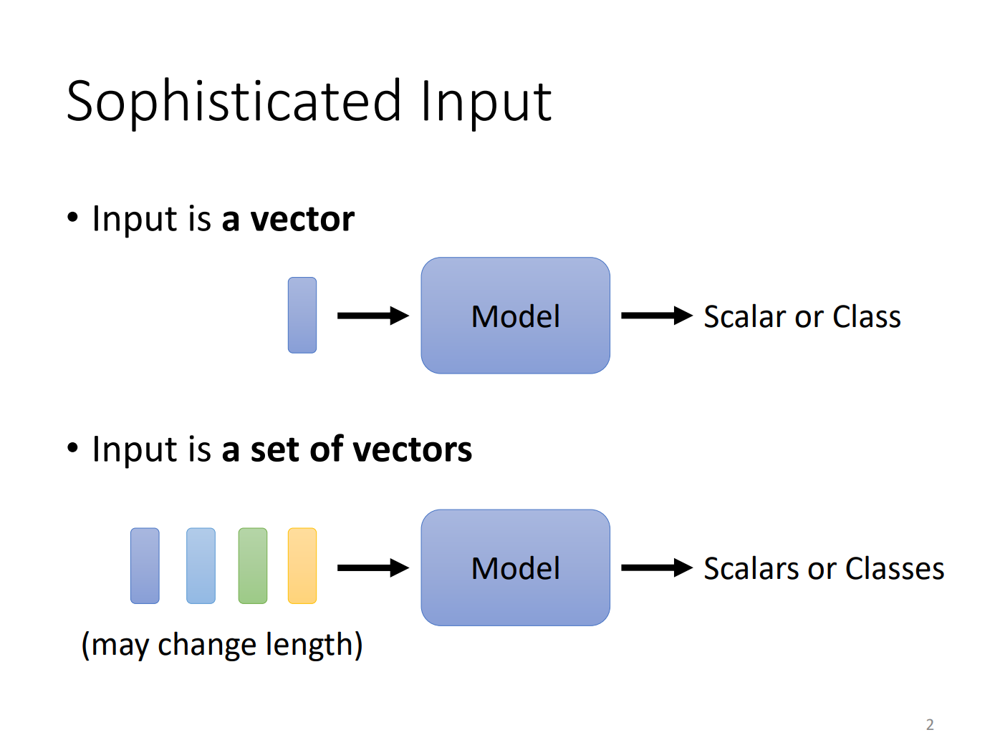

# Lecture 4:Sequence as input
## Self-attention
我们是想通过Self-attention来解决Sophisticated Input的问题，我们前面的全连接和CNN的输入都是一个向量，而且长度都是一致的，我们现在要解决的就是我们想要能够输入一组向量，可能有不同的长度，那我们应该怎么处理？

这种情况会出现在哪些应用中呢？NLP很明显就是这样，如果我们把一句话中的词汇表示成向量进行输入就会是这样，而且无法保证输入的长度一致（因为句子的长度不一致）。那怎么把词汇表示成向量呢？

我们有如下图所示的两种方法，一种是one-hot，这个应该就不用详细介绍了，但有一个需要注意的点就是词汇之间没有关系，因为无法通过距离判断出cat和dog，比cat和apple之间哪个关系更近。还有一种方法是Word Embedding（李宏毅老师也没有详细介绍，可看图中链接），通过这个方法分类的，可能就是动物在一团，植物在另一团这样，如图：

还有什么例子可能是vector set输入呢？还有语音，**图**类别的社交网络，分子等，如下：

语音识别其实是应用比较多的，途中就是一些常用的参数，比方说一个frame长度25ms，还有10ms的步长等等：

### What is the output？

- 每个输入的向量都有对应的输入（向量集中的每个向量都是），比如词性的判断等，如下：

- 所有的向量只有一个输出，也就是一个vector set对应一个输出，比如说判断商品评价的好坏，判断讲话的人等：

- model自己决定输出有多少个，这里的例子是seq2seq，可以想象比如翻译，英文译成中文，可能输入和输出并不是完全对等数量的，总结图如下：

### Sequence Labeling
课程的视频里只讲了第一种的输入和输出，叫做Sequence Labeling。

这里我们拿词性判别来举个例子，假如说我们有一个全连接的神经网络来判断词性，那么第一个问题就来了，I saw a saw. 这句话前面一个saw是动词，后面是名词，但对于全连接神经网络来说，saw的输入是一样，我们没道理输出不一样呀。我们要解决这个问题就需要在全连接中考虑相邻的词汇，也就是考虑上下文，我们可以开一个window，让这个window多包括几个词汇，这样更有利于我们的判断，而且这也避免了输入一致，输出不一致的情况。

但是问题又来了，有的时候我们可能需要考虑一整个sequence才能准确的时候该怎么办？难道我们把window长度和sequence一致？显然不太合理，因为我们的模式输入本来长度就不一致，我们也无法知道最长的sequence到底有多长。那么这时候就该Self-attention登场了：

Self-attention是什么？Self-attention就像是图中所示，你输入几个向量他就会输出几个对应的向量，但是输出之后的向量就和之前不一样了，它是考虑过整个context之后的向量，我们把它输入到全连接层之中，最后输出结果，如下图：

而在实际过程中，我们可能需要不止一次的self-attention，我们有时会在模型中反复的使用self-attention和FC，就是让Self-attention之后的向量输进全连接层得到结果之后，再进行一次Self-attention。关于self-attention最著名的文章就是图中所示，可以查阅：

### self-attention是怎么运作的？
我们知道输出是考虑所有向量的输入，就如下图所示（图中的a可能是我们的原始输入，也可能是在重复结构中的隐藏层）：

我们希望它考虑整个sequence但是又不希望它像我们之前提到的window一样直接考虑所有，所以这时候就会先通过一个attention机制来判断各向量之间的relevant，我们用α来表示，如图：

那么α怎么计算？其实这就是self-attention的重点，α其实有多种计算方式，图中是其中两种，一种是Dot-product，另一种是Addictive，图中的绿色方块代表输入的两个向量，就是要计算这两个向量的α：

还有很多方法来计算α，但是目前常用的就是Dot-product，那么在实际过程是什么样的呢？

实际过程中我们就如图所示，就像我们上面提到的方法，我们用Wk来乘上其它向量然后计算α，其实这里有个问题，就是我们需不需要计算自己的attention，也就是α（1，1）（这里李宏毅老师没讲，但我感觉是需要的）。我们计算完之后然后把所有的α通过softmax：

然后我们再把原来的输入都乘Wv，得到向量集v，然后把softmax后的结果与v相乘，最后加和就得到了我们的输出b，这就是一整个的结果，在这个过程中，如果某两个α较大的话，softmax也会放大其对输出结果的影响力，从而实现self-attention：

